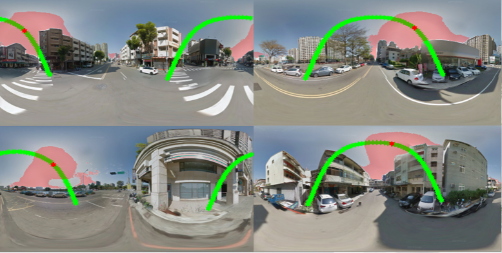

# Sun position estimation on 360 video #
  

A sun position detection project with 2 kinds of method:
1. Solar Position Algorithm (SPA) (main SPA code is from [here](https://github.com/s-bear/sun-position).) 
2. Image-Based Sun detection (IBS) (We use the code from [here](https://github.com/CSAILVision/semantic-segmentation-pytorch) to obtain semantic segmentation mask.)

This project also implements the algorithm introduced in:  
* Generating 360 Outdoor Panorama Dataset with Reliable Sun Position [Chang et al. 2018] [[webpage]](https://cgv.cs.nthu.edu.tw/projects/360SP)

which is presented at the **poster session** of [SIGGRAPH Asia 2018](https://sa2018.siggraph.org/en/) (Tokyo, Japan).  

  

## Quick start ##
Both SPA and IBS will save the output(SP) using 3D vector (in y and z), but the coordinate is specificly used on Unreal Engine 4. If you want to obtain the 2D position on image, the function **[x, y] = getImagePos(width, height, y, z)** in ```misc\visual.py``` can help you to get it.

### SPA ###
To use the SPA algorithm, we need several data, includes GPS, bearing and timestamp.  
All data should be given in a ```.csv``` file, see ```example.csv```.
```bash
python SPA.py --data_path <.csv> --sample_rate <sample rate of data, default=10>
```
After processing, it will save the result at **direction** field in ```YOUR_DATA_lightData.csv``` 
### IBS ###
First, you should **download pretrained weights from [This project](https://github.com/CSAILVision/semantic-segmentation-pytorch)** and put it in ```sun_estimate\pre-trained\```.
```bash
python SPA.py --video_path <YOUR_VIDEO>
```
The output is same to SPA.
### visualize result ###
To plot detected sun position (red star), execute the command:
```bash
python visualize.py --video_path <YOUR_VIDEO> --data_path <OUTPUT_LIGHT_DATA>
```
The output ```out.mp4``` is the result.
## Generate 360 SP dataset ##
Prepare your 360 panorama images and corresponding metadata, then list it as a ```.csv``` file, see ```SP_dataset_example.csv```
```bash
python SPA_GSV_dataset.py --list_path <YOUR_DATA_LIST>
```
Results will be saved in ```GS_sunpos.csv```. (theta and phi is standard spherical coordinate)
## Dependencies ##
* numpy
* pytorch
* opencv-python
* scikit-image
* progressbar


